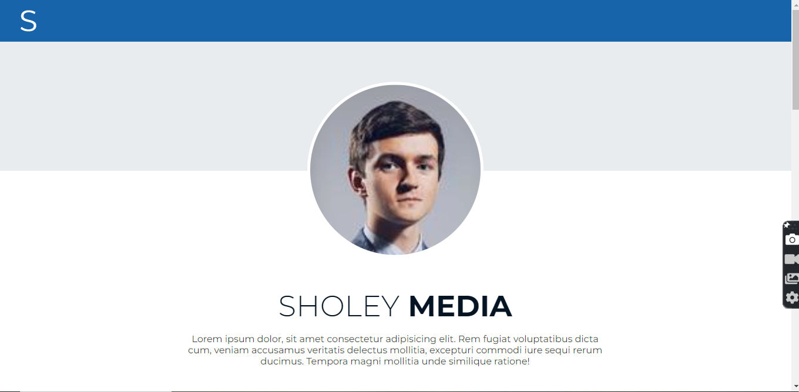

# Sholey Media Concept - Landing page

This is a solution to the [QR code component challenge on Frontend Mentor](https://www.frontendmentor.io/challenges/qr-code-component-iux_sIO_H). Frontend Mentor challenges help you improve your coding skills by building realistic projects.

## Table of contents

- [Overview](#overview)
  - [Screenshot](#screenshot)
  - [Links](#links)
- [My process](#my-process)
  - [Built with](#built-with)

## Overview

### Screenshot

### Links

- Solution URL: [click here](https://musical-lebkuchen-d28c7d.netlify.app/)

## My process

### Built with

- Semantic HTML5 markup
- Sass custom properties
- Position
- CSS Grid
- Mobile-first workflow

## Author

- Website - [my portfolio](https://dev-jamiu.netlify.app/)
- Frontend Mentor - [@williamsaa23](https://www.frontendmentor.io/profile/williamsaa23)
- Twitter - [@jhayone1_2](https://www.twitter.com/jhayone1_2)
